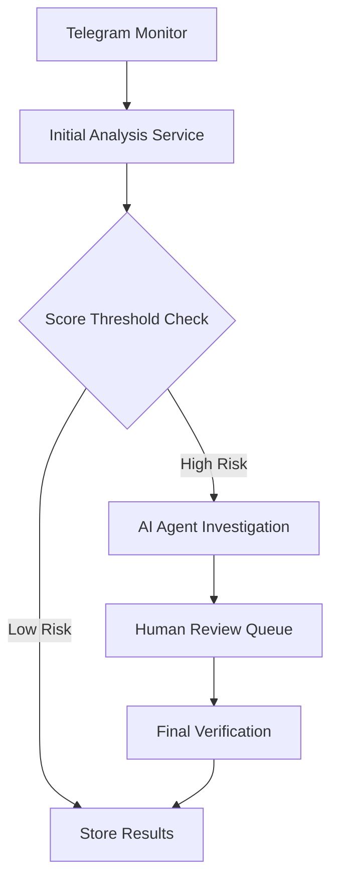

# Disinformation Detection System Architecture

## 1. Core Components Overview

### A. Message Processing Pipeline


### B. System Components

1. **Telegram Integration Layer**
   - TelegramMonitor class (existing)
   - Message queue for processing
   - Real-time event handling

2. **Initial Analysis Service**
   - Quick scoring system
   - Basic metrics calculation
   - Threshold-based flagging

3. **AI Investigation Agent**
   - LangGraph-based workflow
   - Multiple investigation tools
   - State management
   - Human-in-loop integration

4. **Human Review Interface**
   - Dashboard for analysts
   - Review queues
   - Action recommendations
   - Feedback collection

## 2. Detailed Implementation Guide

### A. Message Processing Flow

1. **Initial Message Reception**
```python
class EnhancedTelegramMonitor(TelegramMonitor):
    async def _process_message(self, message: Message, channel: Channel):
        # Existing processing
        data = await self._prepare_message_data(message, channel)
        
        # Add initial analysis
        analysis_result = await self.initial_analyzer.analyze(data)
        data['initial_scores'] = analysis_result.scores
        
        # Store in BigQuery
        await self._store_messages([data])
        
        # If high risk, trigger AI investigation
        if analysis_result.requires_investigation:
            await self.trigger_investigation(data)
```

2. **Initial Analysis Service**
```python
class InitialAnalyzer:
    def __init__(self):
        self.toxicity_model = load_toxicity_model()
        self.veracity_model = load_veracity_model()

    async def analyze(self, message_data: dict) -> AnalysisResult:
        scores = {
            'toxicity': await self.toxicity_model.score(message_data['text']),
            'veracity': await self.veracity_model.score(message_data['text']),
            'risk_level': self.calculate_risk(message_data)
        }
        return AnalysisResult(scores=scores)
```

### B. AI Agent Implementation

1. **LangGraph Agent State**
```python
class DisinfoAgentState(TypedDict):
    message_data: dict
    investigation_status: str
    verification_steps: List[str]
    evidence: List[dict]
    human_feedback: Optional[dict]
    final_scores: dict
    confidence: float
```

2. **Investigation Workflow**
```python
workflow = StateGraph(DisinfoAgentState)

# Add investigation nodes
workflow.add_node("analyze_media", analyze_media_node)
workflow.add_node("verify_claims", verify_claims_node)
workflow.add_node("cross_reference", cross_reference_node)
workflow.add_node("human_review", human_review_node)
workflow.add_node("final_scoring", final_scoring_node)

# Define routing logic
def route_investigation(state):
    if state['requires_human_review']:
        return "human_review"
    if state['pending_media_analysis']:
        return "analyze_media"
    # ... additional routing logic
    return END

# Add edges
workflow.set_entry_point("analyze_media")
workflow.add_conditional_edges(
    "analyze_media", 
    route_investigation,
    ["verify_claims", "human_review", END]
)
```

### C. Human-in-the-Loop Integration

1. **Frontend Dashboard Component**
```typescript
const ReviewDashboard: React.FC = () => {
    const { state, setState } = useCoAgent<DisinfoAgentState>({
        name: "disinfo_agent",
        initialState: { status: "awaiting_review" }
    });

    // Render review interface based on state
    return (
        <div>
            <MessageDetails message={state.message_data} />
            <InvestigationEvidence evidence={state.evidence} />
            <ReviewActions onAction={handleReviewAction} />
        </div>
    );
};
```

2. **Review Action Handler**
```typescript
const handleReviewAction = async (action: ReviewAction) => {
    const updatedState = {
        ...state,
        human_feedback: {
            action: action.type,
            notes: action.notes,
            confidence: action.confidence
        }
    };
    
    setState(updatedState);
    await triggerAgentContinuation(updatedState);
};
```

### D. Integration Points

1. **CopilotKit Configuration**
```python
sdk = CopilotKitSDK(
    agents=[
        LangGraphAgent(
            name="disinfo_agent",
            description="Disinformation detection agent",
            agent=workflow,
            copilotkit_config={
                "emit_intermediate_state": [
                    {
                        "state_key": "investigation_status",
                        "tool": "update_status"
                    }
                ]
            }
        )
    ]
)
```

2. **FastAPI Integration**
```python
app = FastAPI()
add_fastapi_endpoint(app, sdk, "/copilotkit")

@app.post("/telegram/process")
async def process_message(message: TelegramMessage):
    # Initialize investigation
    investigation = await start_investigation(message)
    return {"investigation_id": investigation.id}

@app.get("/investigations/{investigation_id}")
async def get_investigation(investigation_id: str):
    # Fetch investigation status
    return await get_investigation_status(investigation_id)
```

## 3. Development Steps

1. **Phase 1: Core Infrastructure**
   - Enhance TelegramMonitor with analysis capability
   - Implement initial analysis service
   - Set up BigQuery storage for analysis results

2. **Phase 2: AI Agent Development**
   - Implement LangGraph workflow
   - Add investigation tools
   - Integrate with external APIs (news, fact-checking)

3. **Phase 3: Human Review System**
   - Build review dashboard
   - Implement feedback collection
   - Add review queue management

4. **Phase 4: Integration & Testing**
   - Connect all components
   - Add monitoring and logging
   - Performance optimization

## 4. Key Technical Considerations

- **Scalability**: Use message queues for high volume
- **Reliability**: Implement retry mechanisms
- **Security**: Encrypt sensitive data
- **Performance**: Cache frequently accessed data
- **Monitoring**: Add comprehensive logging

## 5. Future Enhancements

1. **Advanced Features**
   - Multi-language support
   - Image/video deep analysis
   - Pattern detection across channels
   - Automated reporting

2. **System Improvements**
   - Real-time analytics dashboard
   - API for external integrations
   - Enhanced investigation tools
   - Machine learning model updates